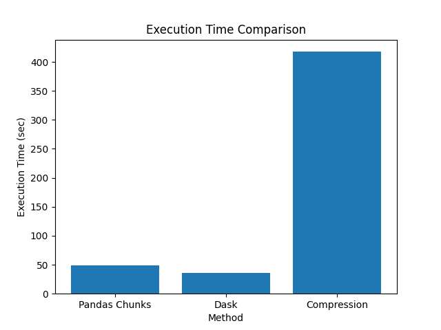
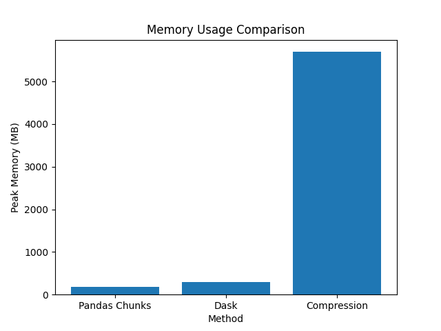

# 🚀 High-Performance Large CSV Processing in Python

## 📌 Project Overview

This project demonstrates efficient techniques for processing very large
CSV files (\~5GB) in Python without causing memory overflow.

The experiment compares different approaches in terms of:

-   ⏱ Execution Time
-   💾 Storage Efficiency
-   🧠 Memory Usage

------------------------------------------------------------------------

# 📂 Dataset

Dataset used:

`ACI-IoT-2023-Payload.csv`

Dataset size:

`5276.13 MB (~5.2 GB)`

⚠ Dataset not included in the repository due to its large size.

------------------------------------------------------------------------

# 🏗 Project Structure

    Big-Data-CSV-Processing-Python
    │
    ├── data
    │   ├── ACI-IoT-2023-Payload.csv
    │   ├── compressed.csv
    │   └── compressed.csv.gz
    │
    ├── result
    │   ├── results.csv
    │   ├── report.txt
    │   ├── time_comparison.png
    │   └── memory_comparison.png
    │
    ├── services
    │   ├── pandas_chunks.py
    │   ├── dask_reader.py
    │   └── compressor.py
    │
    ├── utils
    │   └── timer.py
    │
    ├── main.py
    ├── requirements.txt
    └── README.md

------------------------------------------------------------------------

# ⚙️ Technologies Used

-   Python
-   Pandas
-   Dask
-   Matplotlib
-   gzip

------------------------------------------------------------------------

# 🔬 Methods Implemented

## 1️⃣ Pandas Chunk Processing

``` python
pd.read_csv(file, chunksize=100000)
```

✔ Memory efficient\
✔ Works on machines with limited RAM\
❌ Sequential processing

Execution Time: **49.23 sec**\
Peak Memory: **182 MB**

------------------------------------------------------------------------

## 2️⃣ Dask (Parallel Processing)

``` python
dd.read_csv(file)
```

✔ Parallel processing\
✔ Multi-core utilization\
✔ Designed for large datasets

Execution Time: **35.44 sec**\
Peak Memory: **300 MB**

------------------------------------------------------------------------

## 3️⃣ File Compression (gzip)

Original File Size: **5276.13 MB**\
Compressed File Size: **2966.17 MB**

Storage Reduction: **≈44%**

Execution Time: **417.64 sec**\
Peak Memory: **5694 MB**

------------------------------------------------------------------------

# 📊 Experimental Results

  --------------------------------------------------------------------------
  Method         Execution Time Peak Memory    Original Size  Compressed
                 (sec)          (MB)           (MB)           Size (MB)
  -------------- -------------- -------------- -------------- --------------
  Pandas Chunks  49.23          182.71         5276.13        2966.17

  Dask           35.44          300.05         5276.13        2966.17

  Compression    417.64         5694.81        5276.13        2966.17
  --------------------------------------------------------------------------

------------------------------------------------------------------------

# 📈 Execution Time Comparison



------------------------------------------------------------------------

# 📊 Memory Usage Comparison



------------------------------------------------------------------------

# 🧠 Performance Analysis

🏆 **Fastest Method:** Dask

Dask is faster because it uses **parallel processing** and distributes
computation across CPU cores.

⚖ **Balanced Method:** Pandas Chunking

Provides a good balance between **memory usage and execution speed**.

💾 **Best Storage Optimization:** Compression

Reduces disk usage by about **44%** but requires much more CPU time and
memory.

------------------------------------------------------------------------

# 🧠 Key Takeaways

-   Large CSV files should not be loaded entirely into memory.
-   Chunking improves memory control.
-   Parallel processing (Dask) significantly improves execution speed.
-   Compression trades CPU time for storage efficiency.

------------------------------------------------------------------------

# ▶️ How to Run

## Install dependencies

``` bash
pip install -r requirements.txt
```

## Run the project

``` bash
python main.py
```

The script will:

-   Process the dataset using Pandas chunks
-   Process the dataset using Dask
-   Compress the dataset
-   Generate performance graphs

------------------------------------------------------------------------

# 🎯 Conclusion

This project demonstrates practical techniques for handling
**multi‑gigabyte datasets in Python**.

  Goal               Recommended Method
  ------------------ --------------------
  Fast processing    Dask
  Low memory usage   Pandas Chunks
  Reduce storage     Compression

These techniques are commonly used in **Data Engineering and Big Data
workflows**.
